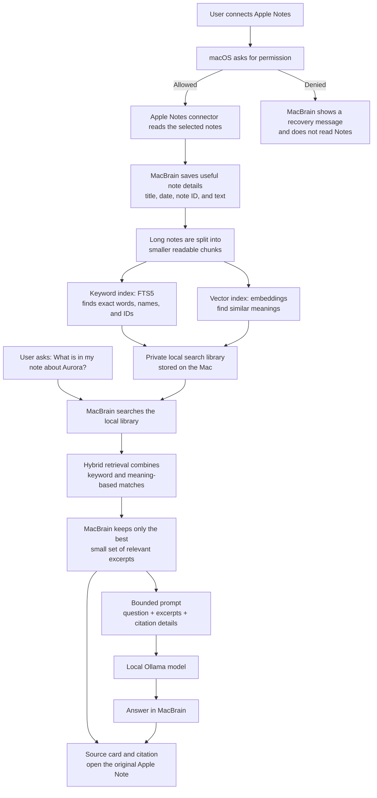

# Aurora release decision

Decision ID: AUR-LOCAL-042.

Project Aurora's beta must keep document retrieval local to the Mac. The approved
search foundation is SQLite FTS5 with local embeddings.

Riya Sen owns the beta release decision. The target beta date is 2026-09-15.

The release cannot proceed unless every answer about Aurora includes a citation
to its originating local source.

## Local Ollama versus hosted model APIs

MacBrain uses local Ollama as its default inference path because its central
promise is private, local knowledge retrieval. Source excerpts, memories,
temporary context, and prompts remain on the Mac by default; frequent
embedding, indexing, and query work does not incur a per-request API cost; and
search/answering can remain available without an internet connection.

The trade-off is that local models can be weaker for difficult reasoning and
writing, while requiring model downloads, disk space, unified memory, and local
setup. The architecture should remain provider-neutral: Ollama is the
privacy-first default, while a future Claude or OpenAI provider can be an
explicit opt-in for users who want stronger answers and consent to sending the
selected prompt and evidence to that provider.

## How an Apple Note becomes a cited MacBrain answer

Connecting Apple Notes does **not** send every note to Ollama. It gives
MacBrain permission to build a private, searchable library on the Mac. When a
user asks a question, MacBrain finds a small number of useful excerpts and
sends only those excerpts, together with the question, to Ollama.



### This flow works for most connectors

Apple Notes is only the example in this diagram. Most connectors follow the
same broad path:

```text
Connector → normalized local documents → chunking and indexing →
keyword + vector retrieval → selected evidence → Ollama → citations
```

What changes is the source-specific information and access boundary. A PDF
provides a file name and page number; a folder provides a path and heading; a
Git repository provides repository, branch, commit, and file facts; mail
provides sender, subject, date, and message/thread details; browser data
provides a page title and URL. Each connector therefore needs its own
permission, parser, stable identity, refresh strategy, and way to open the
original source. Once its data has been normalized into MacBrain’s common local
document format, the indexing, retrieval, RAG, and citation flow is the same.

### Step 1: Connect Notes deliberately

The user chooses the Apple Notes connector. macOS controls whether the app
receives the required permission. If permission is denied, MacBrain reports
that Notes are unavailable and continues to work with other connected sources.

### Step 2: Index the notes

**Indexing** means preparing notes for fast local search. MacBrain saves a
consistent local record for each permitted note: its title, text, date, stable
identity, and enough location information to open the original later. It then
divides long notes into smaller chunks, so a question about one paragraph does
not require putting a whole long note into a model prompt.

Chunking happens **before** MacBrain builds the keyword and vector indexes. It
operates on the note’s searchable text/content; title, date, note ID, and
source location are retained as metadata so a retrieved chunk can still be
identified and cited. In short: one note becomes several content chunks, then
each chunk can be added to the keyword and vector indexes.

MacBrain builds two complementary local search aids from those chunks:

- **Keyword index (SQLite FTS5):** finds exact words, names, IDs, paths, and
  quoted phrases, such as `Aurora` or `AUR-LOCAL-042`.
- **Vector index (embeddings):** finds similar meaning. It represents each
  chunk as a list of numbers, so “launch date” can find a note saying “ship on
  September 15,” even when the exact words differ.

The vector index is not a separate cloud database. It is local data used with
MacBrain’s SQLite-backed knowledge library.

### Step 3: RAG — retrieve evidence, augment the prompt, and generate an answer

**RAG** means *retrieval-augmented generation*: find relevant source material
first, add it to the question, then let the model write an answer using that
material.

RAG has three connected parts:

- **Retrieval:** find relevant chunks from the indexes.
- **Augmentation:** include the selected chunks in the prompt.
- **Generation:** Ollama writes the answer using that evidence.

For “What is in my note about Aurora?”, MacBrain searches both indexes.
Keyword search finds direct mentions of Aurora; vector search finds passages
with related meaning. This combination is **hybrid retrieval**.

MacBrain removes duplicates, keeps only authorized excerpts, and applies a
size budget. Sending every note would be slow, use too much memory, and make
it easier for the model to mix unrelated facts. If vector search is unavailable,
keyword search can still return useful evidence.

MacBrain does not feed the complete index to the model. It sends only the
small, relevant, sorted evidence set for the user’s current question.

For the Aurora question, Ollama might receive:

```text
Question: What is in my note about Aurora?

Evidence from an authorized local note:
- Title: Aurora release decision
- Excerpt: The beta must keep document retrieval local to the Mac.
- Excerpt: The target beta date is 2026-09-15.
- Citation ID: aurora-release-decision
```

Ollama receives this small relevant package—not the entire Apple Notes library.
MacBrain attaches a citation/source card so the user can inspect the original
note. The model is asked to acknowledge missing or conflicting evidence rather
than present a guess as fact.
